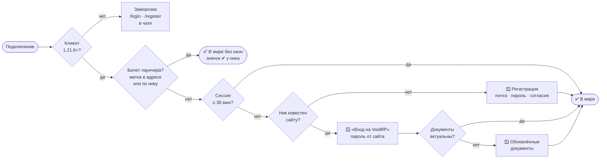

<p align="center"></p>

<div align="center">

[](https://github.com/VOIDRP-MINECRAFT/voidrp-auth-plugin/actions/workflows/build.yml)


</div>

Вход и регистрация на плагинных серверах VoidRP через аккаунт сайта — нативными окнами
Minecraft, без AuthMe и без второй базы паролей.

Игрок, пришедший с любого клиента, видит окно «Вход на VoidRP» и вводит пароль от того же
аккаунта, с которым заходит на void-rp.ru. Если ника нет в базе — открывается окно
регистрации с почтой, паролем и согласиями, и аккаунт создаётся настоящий, как через форму
на сайте. Игроки нашего лаунчера окон не видят вовсе: билет приходит в адресе подключения.

## Схема входа



Все решения принимает бэкенд (`/api/v1/server/auth/game/*`): плагин не хранит и не проверяет пароли.
Окна нельзя закрыть Esc — только отправить или отключиться.

## Как это работает

Окна рисует сам клиент — это серверные диалоги Minecraft 1.21.6+. Плагин показывает их в
фазе конфигурации (`AsyncPlayerConnectionConfigureEvent`), то есть до попадания в мир:
замораживать, прятать инвентарь и глушить чат не нужно, игрока в мире ещё нет.

Пароль плагин не проверяет и не хранит — он спрашивает бэкенд
(`/api/v1/server/auth/game/*`, заголовок `X-Game-Auth-Secret`). Все решения — верный ли
пароль, подписаны ли документы, активен ли аккаунт — остаются на сайте.

Клиенты старше 1.21.6 диалогов не понимают (версию подсказывает ViaVersion). Они попадают
в заморозку и входят командами `/login <пароль>` и `/register <почта> <пароль>`.

## Сборка

```bash
./gradlew shadowJar
# build/libs/voidrp-auth-1.0.0-all.jar
```

Нужен JDK 25 — Paper 26.2 собран под него. Gradle подтянет toolchain сам.

## Установка

1. Положить jar в `plugins/`, запустить сервер, остановить.
2. В `plugins/VoidRpAuth/config.yml` вписать `backend.secret` — значение
   `X-Game-Auth-Secret` этого сервера (админка → Серверы) и `backend.server-slug`.
3. Снять AuthMe, если он стоял: два плагина входа одновременно работать не будут.

## Команды

| Команда | Кому | Что делает |
|---|---|---|
| `/login <пароль>` | игрок | Вход для клиентов старше 1.21.6 |
| `/register <почта> <пароль>` | игрок | Регистрация для них же |
| `/vauth reload` | оператор | Перечитать конфиг |
| `/vauth unlock <ник>` | оператор | Впустить игрока вручную |
| `/vauth status <ник>` | оператор | Вошёл ли и с какого клиента |
